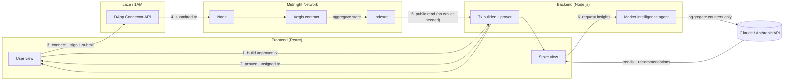

<p align="center">
  
</p>

# AEGIS - Private Commerce Intelligence on Midnight

Market intelligence powered by anonymous ZK signals. Stores see what customers want. Customers stay invisible.

## What is Aegis?

Aegis is a privacy-preserving market intelligence system built on Midnight Network. It solves a fundamental tension in commerce: stores need to know what customers want, but customers don't want to be tracked.

**How it works:**

- Users contribute anonymous purchase signals (by category) to a Midnight smart contract. Each signal generates a ZK proof, the blockchain only knows "one more person bought in electronics", never who.
- The aggregate state (total signals per category) is public and verifiable on-chain.
- An LLM agent reads the aggregate and generates market intelligence, trending categories, insights, and recommendations, without ever accessing individual user data.
- Stores create targeted campaigns with a minimum signal threshold. When enough signals accumulate in a category, their campaign activates.

## Architecture



**Flow:**

1. The user picks a category in the frontend; the backend builds the `submitPurchase` circuit call against the compiled contract and generates the ZK proof with a local proof server. The backend never holds wallet keys, it only ever returns a proven, unsigned transaction.
2. The connected wallet (Lace or 1AM, via the Midnight DApp Connector API) balances, signs, and submits that transaction directly to the Midnight node. Only the category counter increment is visible on-chain, no identity, no link between a user's signals.
3. Aggregate state (`/api/state`) is public ledger data, the backend reads it straight from the Midnight indexer and decodes it with the contract's own `ledger()` function. No proof, no key, no privileged access involved.
4. For the store side, the backend feeds the current aggregate counters to Claude (Anthropic API), which returns trending categories and actionable recommendations. The model only ever sees aggregate numbers, never individual signals or user data.
5. Stores register campaigns on-chain (`registerCampaign`) through the same build-tx-then-wallet-submit flow, and the backend matches campaign thresholds against live state (`/api/match/:id`), again using Claude to explain the reasoning.

## Stack

| Layer | Technology |
|---|---|
| Smart contract | [Compact](https://docs.midnight.network/compact) (compiler `0.31.1`, language `>= 0.20`, runtime `0.16.0`) |
| Contract tests | Vitest, in-memory circuit simulator |
| Backend | Node.js + TypeScript (`tsx`), native `http` server, `@midnight-ntwrk/midnight-js-contracts`, `@midnight-ntwrk/ledger-v8` |
| Market intelligence | Claude (Anthropic Messages API) |
| Frontend | React 18 + Vite 6 + TypeScript |
| Wallet integration | Midnight DApp Connector API, Lace and 1AM |
| Network | Midnight Preprod (node + indexer), local proof server |
| Local devnet | Docker Compose (node + indexer + proof server) |

## Project status

- [x] Anonymous category/subcategory signal circuit (`contract/aegis.compact`)
- [x] Simulator + tests (`contract/`)
- [x] Deployed to Preprod
- [x] Backend: transaction builder/prover + market intelligence agent
- [x] Frontend: store and user views, connected to the deployed contract, wallet integration (Lace/1AM)
- [ ] Verified purchase attestation (store signature), not designed yet
- [ ] Optional age/spend disclosure tied to a pseudonym, not designed yet

`submitPurchase` currently trusts the `subcategory` argument as given, there is no witness, receipt, or store signature yet. Verified purchase attestation and pseudonym-linked disclosure are the next pieces to design and implement, not something already built.

## Contract

```bash
cd contract
npm install
npm run compact     # compile with ZK key generation -> managed/aegis/
npm run demo        # end-to-end example transaction in the simulator
npm test            # contract tests
```

Exported circuits:

| Circuit | What it does |
|---|---|
| `submitPurchase(subcat)` | Purchase signal: reveals the subcategory and increments its aggregate counters. |
| `seed(...)` | Initializes the counters with starting values. Can only be called once. |
| `registerCampaign()` | Registers a campaign and returns its incremental id. |

## Backend

```bash
cd backend
npm install
npm start            # local devnet (MIDNIGHT_NETWORK=local)
npm run start:preprod
npm run start:preview
```

Requires `ANTHROPIC_API_KEY` in `backend/.env` (see `backend/.env.example`) for the market intelligence endpoints.

## Frontend

```bash
cd frontend
npm install
npm run dev
```
