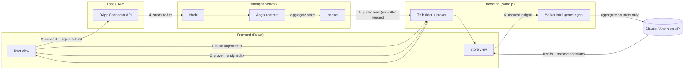

<p align="center">
  
</p>

# AEGIS - Private Commerce Intelligence on Midnight

Market intelligence powered by anonymous ZK signals. Stores see what customers want. Customers stay invisible.

## What is Aegis?

Aegis is a privacy-preserving market intelligence system built on Midnight Network. It solves a fundamental tension in commerce: stores need to know what customers want, but customers don't want to be tracked.

**How it works:**

- A store attests a real purchase on-chain (proof of membership in a registered-stores tree, no store identity revealed) and seals a commitment to the receipt.
- The customer, from that same receipt, publishes a signal: a ZK proof that reveals only the subcategory and quantity, never the amount, the date, or which store. The blockchain only knows "one more person bought in electronics", never who.
- The aggregate state (total signals per category) is public and verifiable on-chain.
- An LLM agent reads the aggregate and generates market intelligence, trending categories, insights, and recommendations, without ever accessing individual user data.
- Stores create targeted campaigns with a minimum signal threshold. When enough signals accumulate in a category, their campaign activates.

## Try it

Everything below runs against Midnight's **Preprod** testnet. No shared deployment, no coordination needed: each person who tries this deploys their own contract instance from the browser and becomes its store admin, so the full loop (register store, seal a receipt, publish a signal) works standalone for anyone who clones the repo.

**Prerequisites**

- Node.js >= 22
- A Midnight proof server reachable at `http://127.0.0.1:6300` (assumed already set up)
- The Compact CLI (`compact`) installed and on your `PATH`, to compile the contract
- A Midnight wallet extension (Lace or 1AM) with some Preprod NIGHT/DUST
- An `ANTHROPIC_API_KEY` — optional, only needed for the market intelligence (insights) endpoints; the purchase/signal flow works without it

**Steps**

1. Install dependencies: `npm install` at the repo root (npm workspaces cover `contract`, `backend`, and `frontend`).
2. Compile the contract: `cd contract && npm run compact` (generates the ZK keys under `contract/managed/`).
3. Start the backend against Preprod: `cd backend && MIDNIGHT_NETWORK=preprod npm run start:preprod` (set `ANTHROPIC_API_KEY` in `backend/.env` first if you want insights). No contract is deployed yet at this point, that happens from the browser next.
4. Start the frontend: `cd frontend && npm run dev`, then open the printed URL.
5. In the browser: **Connect Wallet** (Lace or 1AM, Preprod network) → **Deploy contract** (this deploys a fresh instance and makes your wallet its store admin) → **Register demo store** → **Load demo data** (seeds baseline counters so the store insights have something to talk about).
6. Try the actual flow: in the **Store** tab, add a couple of products to the cart and check out, this seals a signed receipt and shows it as a QR. Switch to the **User** tab and click **Use last receipt** (skips the camera, grabs the receipt you just sealed in this same session), pick what you'd preview-share, and publish the signal. Watch the category counter bump in the stats ribbon.

Camera/QR scanning is temporarily disabled in the UI (it's the same code path once wired to a second device, just not the focus of this demo) — "Use last receipt" replaces it since store and customer are the same session here.

## Architecture



**Flow:**

1. A store checks out a cart in the frontend; the backend builds the `attestReceipt` circuit call (proof of membership in the registered-stores tree, no store identity revealed) and generates the ZK proof. The customer's receipt (subcategory lines, amounts, timestamp) never leaves their device as plaintext, only its commitment gets sealed on-chain.
2. From that receipt, the customer builds and submits `submitPurchase`: the backend proves the circuit, the connected wallet (Lace or 1AM, via the Midnight DApp Connector API) balances, signs, and submits it directly to the Midnight node. Only the subcategory and quantity are revealed, no identity, no amount, no link between a user's signals.
3. Aggregate state (`/api/state`) is public ledger data, the backend reads it straight from the Midnight indexer and decodes it with the contract's own `ledger()` function. No proof, no key, no privileged access involved.
4. For the store side, the backend feeds the current aggregate counters to Claude (Anthropic API), which returns trending categories and actionable recommendations. The model only ever sees aggregate numbers, never individual signals or user data.
5. Stores register campaigns on-chain (`registerCampaign`) through the same build-tx-then-wallet-submit flow, and the backend matches campaign thresholds against live state (`/api/match/:id`), again using Claude to explain the reasoning.

## Stack

| Layer | Technology |
|---|---|
| Smart contract | [Compact](https://docs.midnight.network/compact) (compiler `0.31.1`, language `>= 0.20`, runtime `0.16.0`) |
| Contract tests | Vitest, in-memory circuit simulator |
| Backend | Node.js + TypeScript (`tsx`), native `http` server, `@midnight-ntwrk/midnight-js-contracts`, `@midnight-ntwrk/ledger-v8` |
| Market intelligence | Claude (Anthropic Messages API) |
| Frontend | React 18 + Vite 6 + TypeScript |
| Wallet integration | Midnight DApp Connector API, Lace and 1AM |
| Network | Midnight Preprod (node + indexer), local proof server |
| Local devnet | Docker Compose (node + indexer + proof server) |

## Project status

- [x] Anonymous category/subcategory signal circuit (`contract/aegis.compact`)
- [x] Store registration and receipt attestation (`registerStore`, `attestReceipt`), anonymous membership via `HistoricMerkleTree`
- [x] Simulator + tests (`contract/`)
- [x] Backend: transaction builder/prover + market intelligence agent
- [x] Frontend: store and user views, wallet integration (Lace/1AM), selective-disclosure preview before publishing a signal
- [ ] Optional age/spend disclosure tied to a pseudonym: previewed in the UI, not wired into the contract yet. `submitPurchase` today only ever reveals subcategory and quantity, regardless of what's toggled in the preview.

## Local devnet (optional)

For fully offline development, `docker-compose.yml` spins up a local node + indexer + proof server:

```bash
npm run env:up      # starts the local devnet
MIDNIGHT_NETWORK=local npm run start --workspace backend   # or: cd backend && npm start
npm run env:down    # stops it
```

## Per-package reference

```bash
cd contract
npm run compact       # compile with ZK key generation -> managed/aegis/
npm run compact:fast  # compile without ZK keys, faster iteration
npm run demo           # end-to-end example transaction in the simulator
npm test                # contract tests
```

Exported circuits:

| Circuit | What it does |
|---|---|
| `registerStore(storePk)` | Admin-only: adds a store's public key to the registered-stores tree. |
| `attestReceipt(commitment)` | A registered store seals a receipt's commitment, proving membership without revealing which store. |
| `submitPurchase()` | Purchase signal: reveals the subcategory and quantity of an already-attested receipt, increments its aggregate counters. |
| `seed(...)` | Loads demo baseline counters. Re-runnable, does not reset existing counts. |
| `registerCampaign()` | Registers a campaign and returns its incremental id. |

```bash
cd backend
npm start            # local devnet (MIDNIGHT_NETWORK=local)
npm run start:preprod
npm run start:preview
```

```bash
cd frontend
npm run dev
```
